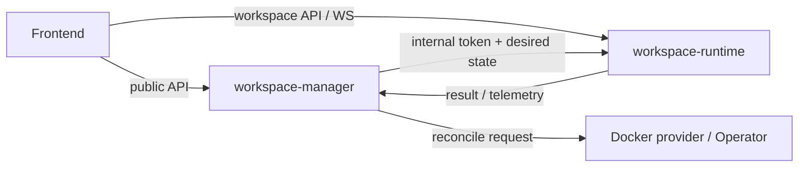

# 後端架構

## 目的與範圍

後端由 `workspace-manager` 控制平面與 `workspace-runtime` 執行平面組成。Manager 擁有平台資源、授權、desired state、排程與治理；Runtime 擁有單一工作區內的互動式執行與工具介面。

## 責任與非責任

Manager 不直接執行 Agent、Terminal 或工作區 Git；Runtime 不擁有平台使用者、分享關係、Marketplace Registry 或工作區生命週期真相。跨服務格式須進入 `contracts/` 或明確的 internal interface，不可由兩端各自猜測。

## Interface、Adapter、Seam 與 Owner



| 邊界 | Owner | 說明 |
| --- | --- | --- |
| Public control-plane API | Manager routers | 平台與資源操作 |
| Operation Policy | Manager authorization module | 最終授權與管理員覆寫稽核 |
| Runtime API | Runtime routers | 工作區內檔案、Git、Agent、Terminal、Browser、Canvas |
| Provisioning Adapter | Manager provider / Operator | Docker 或 Kubernetes 收斂 |
| Shared domain package | `packages/` | File、Git、Marketplace 可重用核心，不反向擁有服務流程 |

## 資料與請求流程

Frontend 先向 Manager 取得資源、授權與 availability；可用後再向對應 Runtime 發出請求。Manager 的背景工作負責長時間操作與失敗復原。Runtime 的 execution 與 thread 狀態持久化於 Runtime PostgreSQL，不能以 Manager 資料庫替代。

## 狀態、錯誤與失敗模式

跨服務失敗須保留 stable error code、correlation 與可恢復狀態。Manager 只在 observed state 符合要求時宣告收斂；Runtime generation 過期、內部憑證無效或 workspace identity 不符時拒絕請求。

## 授權、i18n 與安全

Manager 是授權 Owner。Runtime 只接受 Manager 簽發的 workspace-scoped 內部身分，不接受 Frontend 自行宣稱角色。後端錯誤碼保持穩定且英文，Frontend 將錯誤映射至 i18n 文案；秘密不寫入 log。

## 原始碼索引

- `workspace-manager/app/main.py::create_app`
- `workspace-manager/app/modules/authorization/operation_policy.py::AuthorizationOperationPolicy`
- `workspace-manager/app/modules/workspace/`
- `workspace-manager/app/modules/automation/`
- `workspace-runtime/app/main.py::create_app`
- `workspace-runtime/app/modules/thread/`
- `workspace-runtime/app/modules/version_control/`
- `workspace-runtime/app/modules/internal/`

## Container 驗證

```bash
docker compose -f workspace-manager/docker-compose.test.yml run --rm workspace-manager-test pytest
docker compose -f workspace-runtime/docker-compose.test.yml run --rm workspace-runtime-test pytest
```

## 相關文件與 API

- [workspace-manager](/architecture/backend/workspace-manager/)
- [workspace-runtime](/architecture/backend/workspace-runtime/)
- [Manager API](/api/manager-api)
- [Runtime API](/api/runtime-api)

