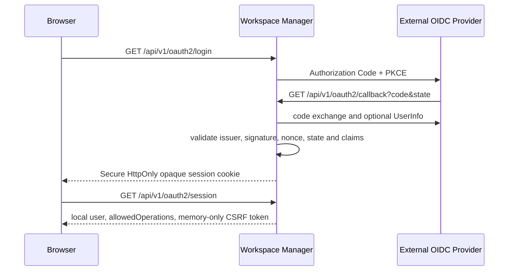

# 身分與存取控制

## 信任邊界

外部 OIDC provider 只與 Workspace Manager 建立信任。Manager 是唯一 OIDC client、
Discovery／JWKS consumer 與 provider token consumer；Frontend、Runtime、Terminal 與
Operator 都不取得 provider token 或 OIDC client 設定。核心 Helm Chart 不部署 IdP。

Manager 以 canonical `(issuer, sub)` 識別 External Principal，再映射為本地 `user_id`。
Email、username、姓名與 groups 只作顯示快照；平台角色與資源授權完全由 Manager 管理。

## 登入與 BFF Session

Session handle 是 256-bit 隨機值；PostgreSQL 只保存雜湊。Manager API Cookie 使用
`Secure`、`HttpOnly`、`SameSite=Lax`。`/workspaces` Gateway Cookie 使用 `Secure`、
`HttpOnly`、`SameSite=None`，讓維持 opaque-origin sandbox 的 Canvas 子資源能完成 Gateway
授權；Gateway 只用它向 Manager 驗證唯讀 Workspace 存取，轉送上游前會移除 Cookie。
預設 idle timeout 為 30 分鐘、absolute lifetime 為 8 小時；
有效 Session 期間的請求認證、平台授權與資源授權完全由 Manager 本機處理，不呼叫 IdP、
UserInfo、introspection 或 Provider Token refresh。每次請求都重新檢查本地使用者狀態，
因此本機停權、角色變更與 Session 撤銷會在下一個請求生效。Mutation 另需符合 canonical
`Origin` 並提供 session-bound `X-CSRF-Token`。登出使用 `POST /api/v1/oauth2/logout`，先撤銷
本地 session，再 best-effort 使用 provider end-session URL。

Session 缺少、過期、撤銷或 principal binding 不一致時，Manager 回傳
`401 MANAGER_SESSION_REQUIRED`，Frontend 只啟動一次 OIDC 重新登入。本地使用者停權、
identity disabled、sync status 或平台角色無效時，Manager 回傳
`403 PLATFORM_AUTHORIZATION_DENIED`；Session 證據維持有效，Frontend 顯示無權限狀態，
不重新登入。重新進入 OIDC authorization flow 不保證顯示帳密畫面，仍由 IdP 的 SSO
Session 政策決定。

## Execution Grant

Browser 要存取 execution plane 時，使用 Manager session 呼叫
`POST /api/v1/workspaces/{workspaceId}/execution-grants`。Manager 對每個 requested action
完成平台授權後，簽發固定 60 秒的 Workspace Execution Access Grant。

Grant 綁定本地 `user_id`、Workspace、Runtime instance、runtime access revision、單一
audience、明確 action set、`iat`、`exp` 與 `jti`。Audience 只能是：

- `workspace-runtime`：可包含 `runtime_read`、`runtime_write`、`workspace_settings`、
  `agent`、`automation`、`browser_automation`，不得包含 `terminal`。
- `workspace-terminal`：只能包含 `terminal`。

Grant 在 60 秒內可重複使用，但只允許新的 request 或 WebSocket handshake；Frontend
只在記憶體中快取。HTTP 使用 `Authorization: Bearer`，WebSocket 使用 bearer subprotocol
並驗證 `Origin`，query-string token 一律拒絕。Instance 或 revision 不符時立即 fail closed。

## 簽章權威

Manager-to-Execution Signing Authority 使用 installation-owned Ed25519 key。Private key
只掛載 Manager，Runtime 與 Terminal 只掛載 public JWKS。Execution Grant 與 one-time
assertion 可共用 key authority，但 token kind、audience、claims schema、verifier 與 replay
semantics 完全分離。

正式 claims 與跨語言向量位於 `contracts/workspace-execution-access/`。

## 相關文件

- [Manager OIDC BFF 與 Session](/architecture/backend/workspace-manager/identity-and-access)
- [外部 OIDC 安裝](/installation/oidc)
- [Runtime API](/api/runtime-api)
- [權限與角色](/features/platform/permissions-and-roles)
