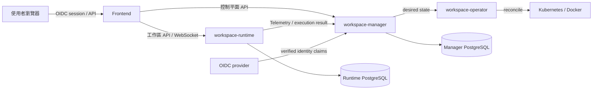

# 整體架構

## 目的與範圍

Aileron 是由瀏覽器前端、控制平面 `workspace-manager`、每個工作區的 `workspace-runtime`、背景工作與 Kubernetes Operator 組成的 AI 開發工作區平台。本頁定義跨服務責任、信任邊界與主要資料流；服務內部實作分別由[前端架構](/architecture/frontend/)與[後端架構](/architecture/backend/)說明。

## 責任與非責任

整體架構負責產品邊界、跨服務契約、身分與授權、執行平面、AI Chat、版本控制、網頁畫布及平台資源觀測。API 欄位與端點以 [Manager API](/api/manager-api) 與 [Runtime API](/api/runtime-api) 為準，本頁不重複維護端點清單。

## Interface、Adapter、Seam 與 Owner

| 類型 | Owner | 契約 |
| --- | --- | --- |
| Product Interface | Frontend | route、Product Shell、操作狀態與 i18n |
| Control-plane Interface | workspace-manager | 資源生命週期、Operation Policy、持久化與工作排程 |
| Execution Adapter | workspace-runtime | 工作區內檔案、Git、Agent、Terminal、Browser 與 Canvas |
| Reconciliation Seam | workspace-operator | Kubernetes Workspace desired／observed state |
| Machine Contract | `contracts/` | 授權、可用性與平台資源觀測的跨層資料格式 |



## 資料與請求流程

1. Frontend 由 `/api/v1/oauth2/session` 取得 Manager 驗證過的使用者快照與 platform `allowedOperations`。
2. Workspace 或知識庫清單另回傳 `accessRole`、`accessSource(s)` 與 resource `allowedOperations`。
3. Manager 建立或變更 desired state；Docker provider 或 Operator 讓執行環境收斂。
4. Frontend 只在 availability 與 operation gate 通過後連線 Runtime；Runtime 以 Manager 簽發且含 generation 的內部憑證再次驗證。
5. Runtime 將 durable execution 結果與平台資源觀測回報 Manager，由 Manager 建立查詢模型。

## 狀態、錯誤與失敗模式

控制平面與執行平面分離：Manager 可用不代表 Runtime 可用。Frontend 對 loading、empty、denied、unavailable、stale generation 與 recoverable error 分別呈現；授權資料缺欄位、generation 不一致或跨服務契約不合法時一律 fail closed。背景工作採 durable state，不能以單次 HTTP 成功代表收斂完成。

## 授權、i18n 與安全

OIDC provider 負責登入與 provider claims；Manager 以 issuer + subject 維護本地 identity、`admin/member` 平台角色、`reader/manager/owner` 資源角色、Operation Requirement 與最終授權。Frontend 只消費 `allowedOperations`，不自行展開角色。所有使用者訊息使用 i18n key；秘密值不得進入前端、文件範例或 log。詳見[身分與存取控制](/architecture/overview/identity-and-access)。

## 原始碼索引

- `frontend/src/app/AppRouter.tsx::AppRouter`
- `frontend/src/app/AppShell.tsx::AppShell`
- `workspace-manager/app/main.py::create_app`
- `workspace-manager/app/modules/authorization/operation_policy.py::AuthorizationOperationPolicy`
- `workspace-runtime/app/main.py::create_app`
- `workspace-operator/internal/controller/workspace_controller.go::WorkspaceReconciler`
- `contracts/authorization/wire-contract.json`
- `contracts/workspace-availability.json`

## Container 驗證

```bash
docker compose -f docs-site/docker-compose.test.yml run --rm docs-test npm test
docker compose -f docs-site/docker-compose.test.yml run --rm docs-test npm run typecheck
docker compose -f docs-site/docker-compose.test.yml run --rm docs-test npm run build
```

## 相關文件與 API

- [前端架構](/architecture/frontend/)
- [後端架構](/architecture/backend/)
- [執行平面](/architecture/overview/execution-plane)
- [平台資源觀測](/architecture/overview/platform-resource-observability)
- [功能：平台總覽](/features/platform/)
