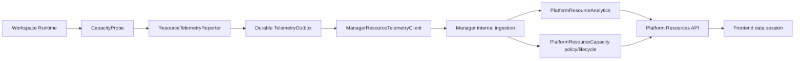

# 平台資源與 Runtime Telemetry 架構

平台資源功能由 Runtime 產生低敏感度的 activity 與 capacity observation，Manager 建立 analytics read model 與 capacity governance projection，Frontend 分別載入管理資料與統計分析資料。使用者操作不依賴 telemetry transport 成功。

## 跨執行面資料流



## Runtime Telemetry

`workspace-runtime/app/modules/resource_telemetry/reporter.py` 的 `ResourceTelemetryReporter` 是 Runtime 端 interface：

- `capture_capacity()` 透過 `CapacityProbe` 量測 Workspace project data 與 Runtime HOME。
- `record_activity()` 產生 `runtime_started`、Agent activity 與其他明確 activity event。
- `TelemetryOutbox` 先持久化 `TelemetryBatch`，再交給 `ResourceTelemetrySink` 傳送。
- `dispatch_pending()` 以 batch limit 傳送待處理資料；失敗時保留 outbox row，下一輪 retry。
- startup、固定週期、檔案 mutation 後的 delayed probe 與 shutdown drain 都由 Reporter lifecycle 管理。

Reporter 是 fail-open：probe、outbox 或 transport 失敗只記錄 telemetry metrics，不阻擋檔案、Git、Thread、Automation 或其他 Runtime 操作。Capacity probe 具 bounded timeout 與 non-overlap lock；同一時間只允許一個 probe。

Runtime measurement scope 為 Workspace project root 與 `/home/developer`：

- 不追蹤 symlink。
- `/knowledge/<alias>` 是唯讀 mounted Knowledge Base，不計入 Workspace Project Data 或 Runtime HOME。
- payload 只包含 workspace identity、runtime instance identity、時間、activity event 與容量 bytes。
- 不傳送 prompt、內容、檔名、路徑、page view 或健康檢查事件。

## Manager ingestion 與 read model

Runtime 以 scoped Bearer 呼叫 Manager internal route：

```text
POST /api/v1/internal/workspaces/{workspace_id}/resource-telemetry/batches
```

`platform_resource_analytics/internal_router.py` 驗證 workspace、runtime instance 與 batch payload；相同 batch 或 event identity 重送時回傳 deduplicated 結果，不重複計算 activity。Ingestion 將 telemetry observation 分派給下列 owning module：

| Module | Interface 責任 |
|---|---|
| `platform_resource_analytics` | activity ledger、daily active aggregate、latest capacity observation、capacity daily snapshot 與 Redis cache-aside read model |
| `platform_resource_capacity` | risk policy、freshness、storage kind、inventory projection/filter、Knowledge Base quota 與 Workspace capacity expansion lifecycle |
| Workspace CR module | typed capacity domain model 與 Kubernetes wire contract 轉換 |

`PlatformResourceAnalytics` 直接擁有 SQL、cache freshness 與 analytics read model maintenance。Redis 不可用時，摘要與趨勢使用 PostgreSQL；analytics module 不把 cache failure 轉成空資料。

## Capacity governance

Runtime 只回報 observation，不判定 risk。`CapacityGovernancePolicy` 同時提供 in-process assessment 與 SQL expression，確保 inventory filter、projection 與 UI 顯示使用同一份 policy：

- `normal`：低於 warning threshold。
- `warning`：使用率達 80%。
- `critical`：使用率達 95%。
- `unknown`：尚無成功量測。
- `stale`：最後成功量測超過 7200 秒。

Knowledge Base 的 `quota_bytes = null` 代表使用 platform default quota。Workspace capacity expansion 以 allocation、request 與 target revision 驅動；Manager 收到目前 revision 且 allocated bytes 達到 requested bytes 才回報 `completed`，只送出 Kubernetes desired state 時保持 `applying`。

完整 resource kind、storage kind、range、health group、retention 與 endpoint 清單以 [平台資源統計與容量治理](/features/platform/resource-statistics-and-capacity) 為準。

## Frontend data session

Platform Resources 將管理清單與統計分析拆成不同 data surface：

- 管理 surface 載入 inventory、搜尋、篩選、排序、owner candidates、quota 與 capacity expansion mutation。
- 分析 surface 依 `7d`、`30d`、`90d` 載入 summary、resource trend 與 capacity trend。
- resource kind、期間、管理查詢與統計查詢各自有 URL／query identity。
- 每個資料區塊有獨立的 loading、error、retry 與 refresh；單一區塊失敗不清空其他已成功資料。
- Mutation success 只 invalidate 受影響的 inventory、projection 與 statistics query，不進行全站重載。

`usePlatformResourcesDataSession()` 是 Frontend feature orchestration interface；`PlatformResourcesPage` 只組合 session 回傳的 data、mutation、state 與 view model，不直接編排多組 API effect。

## Cache、retention 與隱私

| 資料 | Policy |
|---|---|
| Status summary cache | Redis TTL 30 秒；Redis unavailable 時查 PostgreSQL |
| Activity trend cache | Redis TTL 300 秒 |
| Capacity trend cache | Redis TTL 300 秒 |
| Raw activity event | 保留 90 天 |
| Daily activity aggregate | 永久保留 |
| Capacity daily snapshot | 永久保留 |

Activity ledger 只保存 resource type、resource id、event type、timestamp 與 dedupe identity。Telemetry 不承載使用者內容，也不成為另一個檔案或 Thread history store。

## Source index

| 責任 | Current owner |
|---|---|
| Runtime reporter | `workspace-runtime/app/modules/resource_telemetry/reporter.py` |
| Runtime probe and models | `workspace-runtime/app/modules/resource_telemetry/capacity.py`、`models.py` |
| Durable outbox | `workspace-runtime/app/modules/resource_telemetry/outbox.py` |
| Manager sink contract | `workspace-runtime/app/modules/resource_telemetry/sink.py` |
| Manager ingestion route | `workspace-manager/app/modules/platform_resource_analytics/internal_router.py` |
| Analytics read model | `workspace-manager/app/modules/platform_resource_analytics/projection.py` |
| Analytics ingestion | `workspace-manager/app/modules/platform_resource_analytics/ingestion.py` |
| Capacity policy and lifecycle | `workspace-manager/app/modules/platform_resource_capacity/` |
| Frontend data session | `frontend/src/features/platform-resources/data-session/usePlatformResourcesDataSession.ts` |
| Shared wire contract | `contracts/platform-resource-observability/wire-contract.json` |

## 驗證契約

- Runtime container tests 驗證 probe timeout、non-overlap、outbox durability、retry、shutdown drain、fail-open 與 sink wire contract。
- Manager container tests 驗證 batch authentication、workspace/runtime identity、deduplication、analytics aggregation、cache fallback 與 capacity projection。
- Frontend container tests 驗證 data session 的 query identity、independent failure、mutation invalidation、i18n 與頁面狀態。
- Docs contract test 驗證雙語頁面包含 shared wire contract 的 enum、threshold、retention 與 endpoint，並驗證 sidebar 入口存在。

