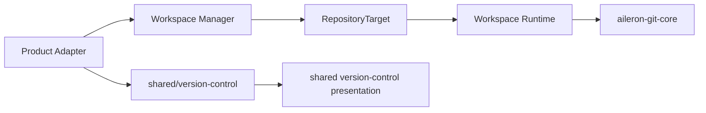

# 共用版本控制與 Repository Setup

Workspace、Knowledge Base 與 Marketplace 使用同一組 Git operation interface、資料 query contract 與工作台 presentation。產品差異只由 Adapter 提供 Repository target、scope identity、capability、API mapping 與產品內容；Git core 不理解產品名稱。

## 跨層 ownership



| Layer | Current interface | Implementation responsibility |
|---|---|---|
| Product Adapter | scope、resource identity、target identity、capability 與 operation path | 解析產品 route、resource、Workspace worktree context 與授權結果 |
| Manager target module | `RepositoryTarget` resolver | 將受管理 resource 解析為安全 root、lock scope keys、environment 與 branch policy |
| Runtime Version Control | `GitService`、`WorkingTreeOperationPort` | 在目前 Runtime target 執行 Git operation，協調 file write barrier 與 cache effects |
| `aileron-git-core` | `RepositoryTarget`、`OperationManager`、operation contracts | Git transport、branch、remote、LFS、lock scope 與 operation state |
| Frontend data package | `createVersionControlCore()` | 依 scope、instance、target 建立 query key、API request、invalidate 與 refresh |
| Frontend presentation package | shared Version Control components | Branch、changes、history、diff、remote、LFS、operation status 與共用 menu／dialog |

Frontend `@/shared/version-control` 不 import React presentation；`@/shared/components/version-control` 只依賴 data package。Workspace、Knowledge Base 與 Marketplace 各自保留 route、permission、mutation 與 target Adapter。

## Repository target interface

`aileron-git-core` 的 `RepositoryTarget` 是 Git operation 的唯一 target contract：

```py
class RepositoryTarget:
    root: Path
    lock_scope_keys: LockScopeKeys
    environment: Mapping[str, str]
    protected_branches: tuple[str, ...]
    checked_out_branches: tuple[str, ...]
```

Target resolver 必須在產品或 Manager 邊界完成：

- Knowledge Base 以 `knowledge-base:{knowledge_base_id}` 作為 common repository 與 working tree target identity，root 限定於該 Knowledge Base managed storage。
- Marketplace 以 `marketplace:registry` 作為 Registry repository identity，root 限定於 managed Registry storage。
- Workspace 將目前主要工作目錄或選定 Worktree 解析成作用中的 target；Worktree context 只存在於 Workspace Adapter／route seam，共用 Git core 不解析 Worktree。
- `environment` 只傳遞該 target 所需的 Git 執行環境；protected branch 與 checked-out branch policy 由 target 提供。

任意未驗證的檔案路徑、產品名稱、Workspace resource role 或 `contextId` 不可直接進入共用 Git core。

## Lock scope

Git operation 使用兩種鎖 scope：

| Scope | 保護資料 | 可平行化行為 |
|---|---|---|
| `working_tree_target` | 特定工作目錄與 Index 的 Stage、Unstage、Discard、Mark Resolved、LFS snapshot conversion 等操作 | 不同 Worktree target 可同時執行 target-only operation |
| `common_repository` | refs、objects、remotes、config 與 Worktree metadata | 不同 Repository 可同時執行 common-only operation |

依 operation contract，操作取得 target-only、common-only 或兩者。需要兩者時固定先取得 `common_repository`，再取得 `working_tree_target`。`OperationManager.acquire_read_scoped()` 以相同順序 fence read，避免讀取 mutation 中間狀態。

Runtime 的 `WorkingTreeOperationPort` 提供兩個 caller-facing surface：

- `mutate(operation_key, operation_name)`：保護一般檔案 mutation，成功後觸發 file-write cache invalidation。
- `execute(...)`：執行 Version Control callback，依 operation kind 取得 Git lock，成功後依 `cache_effects` invalidates cache。

`WorkingTreeOperations` 是 adapter；File module 與 Version Control module 共享同一個 operation coordinator，不各自建立 lock 或 cache recovery。

## Frontend data identity

`createVersionControlCore()` 以三個值形成 data identity：

1. `scope`：`workspace`、`knowledge-base` 或 `marketplace`。
2. `instanceToken`：resource identity；Marketplace 使用 fixed shared instance，Workspace／Knowledge Base 使用 resource identity。
3. `targetToken`：目前 Repository target identity，例如 Workspace Worktree。

所有 query key 都以 `version-control / scope / instanceToken / targetToken / capability-group / operation` 開頭。Mutation 成功後只 invalidate 受影響 capability group；`refresh()` 先失效目前 query，再 refetch active query，Changes query 的 blocking failure 會回傳給 caller。

產品 session Adapter 負責 base URL、resource id、target identity、operation path 與 product-specific response mapping。Shared data core 不知道 route 或頁面名稱。

## Repository Setup interface

Repository Setup 是 shared Version Control workflow，提供三條 setup command：

- `initialize(defaultBranch)`：在尚未初始化且 `canInitSafely` 的 target 建立 Git repository，使用使用者選定的 default branch。
- `discoverBranches(remoteUrl)`：查詢 remote branch，回傳 branch list 與 default branch。
- `clone(remoteUrl, branch?)`：在尚未初始化且 `canCloneSafely` 的 target clone remote repository；branch 可使用已 discovery 的選項。

`useRepositorySetupWorkflow()` 以 `RepositorySetupState` 與 `RepositorySetupViewModel` 管理流程。`phase` 為 `idle`、`initializing`、`discovering` 或 `cloning`；`canOpen*`、`canSubmit*` 與 `safetyKnown` 由 target repository status、`canMutate` 與 boundary settled state 一起決定。

每一個 command 包含 `generation`、遞增 `id` 與 `kind`。target、repository status 或 mutation capability 改變時，workflow 產生新的 boundary generation；不屬於目前 generation 或目前 command 的 async result 不得修改 state。這個 generation fence 同時保護 remote branch discovery、initialize 與 clone。

## 工作台行為

三個產品共用下列資料與互動 contract：

- Branch Selector 顯示 current、local、remote branch、upstream、ahead／behind 與 detached HEAD 狀態。
- Remote-only branch 先建立 local tracking branch，再切換至該 branch；建立 branch 的 start point 與 upstream 由明確 dialog input 決定。
- Pull 只接受乾淨且可 fast-forward 的 working tree；Push 禁止 force push；分歧時回報狀態，不自動 merge、rebase、stash 或改寫歷史。
- 未解衝突時阻擋 Branch switch、Pull、Commit 與 Revert，但允許 Fetch；使用者透過 File Changes 的 Stage／Mark Resolved 完成衝突閉環。
- LFS 的追蹤規則以目前 branch 的 `.gitattributes` 為準；LFS snapshot preview 是唯讀 operation，snapshot conversion 受 target lock 保護。
- Repository Setup、首次載入、空白、權限不足、讀取錯誤與內容狀態都在 ProductShell region 內呈現，不插入會改變頁面幾何的全域 Banner。
- Read-only operation 保持可見但 disabled 並提供原因；真正不存在的 product capability 才不建立對應 region 或 menu item。

## 產品組合

| 產品 | Repository target | Product-specific responsibility |
|---|---|---|
| Workspace | 主要工作目錄或 Workspace Worktree | context selection、Worktree lifecycle、runtime access、Workspace-specific menu extension |
| Knowledge Base | 每個 Knowledge Base 的 managed repository | KB API、resource role、sharing、attachment 與 single repository context |
| Marketplace | Marketplace Registry managed repository | canonical package、Registry policy、publish branch 與 package content |

三個產品的 Git operation 使用相同的 shared data 與 presentation；產品只提供 target、route、permission、copy 與 capability。Workspace Worktree 不出現在 Knowledge Base 或 Marketplace 的 API、type、i18n、測試替身或條件分支。

## Source index

| 責任 | 目前 owner |
|---|---|
| Repository target contract | `packages/aileron-git-core/src/aileron_git_core/contracts.py` |
| Lock and operation coordination | `packages/aileron-git-core/src/aileron_git_core/operation_lock.py` |
| Manager target resolvers | `workspace-manager/app/modules/version_control/target.py` |
| Runtime file／Git seam | `workspace-runtime/app/modules/version_control/working_tree_operations.py` |
| Runtime Git implementation | `workspace-runtime/app/modules/version_control/git_operations.py` |
| Frontend data core | `frontend/src/shared/version-control/versionControlSessionCore.ts` |
| Repository Setup state machine | `frontend/src/shared/version-control/repositorySetupWorkflowCore.ts` |
| Repository Setup effects | `frontend/src/shared/version-control/repositorySetupWorkflow.ts` |
| Shared Version Control presentation | `frontend/src/shared/components/version-control/` |
| Workspace target integration | `frontend/src/features/workspace/integrations/version-control/` |

## 驗證契約

實作或修改版本控制時，測試必須穿過對應 interface：

- `aileron-git-core` 驗證 target lock、operation classification、deadlock-free ordering、branch、remote、LFS 與 error contract。
- Runtime container tests 驗證 File／Git operation barrier、cache invalidation、API wire contract 與 conflict／stale lock 行為。
- Frontend container tests 驗證 shared data identity、query invalidation、Repository Setup generation fence、surface state 與 shared menu／dialog。
- Product tests 驗證 Workspace、Knowledge Base、Marketplace 對同一能力的 target、permission、route 與 layout mapping。
- 不建立產品專屬 Git core、第二套 Repository Setup state machine 或只包一層轉呼叫的 shallow Adapter。
