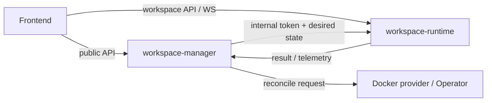

# Backend Architecture

## Purpose and Scope

The backend consists of the `workspace-manager` control plane and the `workspace-runtime` execution plane. Manager owns platform resources, authorization, desired state, scheduling, and governance. Runtime owns interactive execution and tool interfaces inside one workspace.

## Responsibilities and Non-responsibilities

Manager does not execute agents, terminals, or workspace Git directly. Runtime does not own platform users, sharing relationships, the Marketplace Registry, or workspace lifecycle truth. Cross-service formats belong in `contracts/` or an explicit internal interface; services must not infer them independently.

## Interface, Adapter, Seam, and Owner



| Boundary | Owner | Description |
| --- | --- | --- |
| Public control-plane API | Manager routers | platform and resource operations |
| Operation Policy | Manager authorization module | final authorization and audited admin override |
| Runtime API | Runtime routers | workspace files, Git, agents, Terminal, Browser, and Canvas |
| Provisioning Adapter | Manager provider / Operator | Docker or Kubernetes convergence |
| Shared domain package | `packages/` | reusable File, Git, and Marketplace core without service workflow ownership |

## Data and Request Flow

Frontend first obtains resources, authorization, and availability from Manager, then calls the corresponding Runtime only when available. Manager background jobs own long-running operations and recovery. Runtime execution and thread state persist in Runtime PostgreSQL and cannot be replaced by the Manager database.

## State, Errors, and Failure Modes

Cross-service failures preserve stable error codes, correlation, and recoverable state. Manager declares convergence only when observed state meets the request. Runtime rejects stale generations, invalid internal credentials, and mismatched workspace identity.

## Authorization, i18n, and Security

Manager is the authorization owner. Runtime accepts only a Manager-issued workspace-scoped internal identity and never trusts a role asserted by Frontend. Backend error codes remain stable and English; Frontend maps them to i18n messages. Secrets are not logged.

## Source Index

- `workspace-manager/app/main.py::create_app`
- `workspace-manager/app/modules/authorization/operation_policy.py::AuthorizationOperationPolicy`
- `workspace-manager/app/modules/workspace/`
- `workspace-manager/app/modules/automation/`
- `workspace-runtime/app/main.py::create_app`
- `workspace-runtime/app/modules/thread/`
- `workspace-runtime/app/modules/version_control/`
- `workspace-runtime/app/modules/internal/`

## Container Verification

```bash
docker compose -f workspace-manager/docker-compose.test.yml run --rm workspace-manager-test pytest
docker compose -f workspace-runtime/docker-compose.test.yml run --rm workspace-runtime-test pytest
```

## Related Documentation and APIs

- [workspace-manager](/architecture/backend/workspace-manager/)
- [workspace-runtime](/architecture/backend/workspace-runtime/)
- [Manager API](/api/manager-api)
- [Runtime API](/api/runtime-api)

