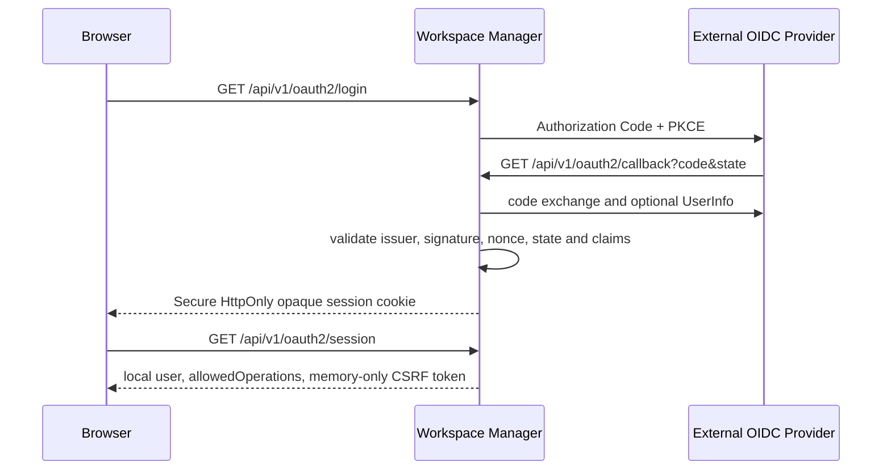

# Identity and Access Control

## Trust boundary

Only Workspace Manager trusts the external OIDC provider. Manager is the sole OIDC client,
Discovery/JWKS consumer, and provider-token consumer. Frontend, Runtime, Terminal, and Operator
receive neither provider tokens nor OIDC client configuration. The core Helm Chart does not deploy
an identity provider.

Manager identifies an External Principal by canonical `(issuer, sub)` and maps it to a local
`user_id`. Email, username, name, and groups are display snapshots only. Manager exclusively owns
platform roles and resource authorization.

## Login and BFF session

The session handle is a 256-bit random value and PostgreSQL stores only its hash. The Manager API
cookie is `Secure`, `HttpOnly`, and `SameSite=Lax`. The `/workspaces` gateway cookie is `Secure`,
`HttpOnly`, and `SameSite=None`, allowing Canvas subresources to pass gateway authorization while
the iframe retains its opaque-origin sandbox. The gateway uses it only to authorize read-only
Workspace access with Manager and strips the cookie before proxying upstream. The default idle
timeout is 30 minutes and the absolute lifetime is eight hours. During a valid Session, Manager
handles request authentication, platform authorization, and resource authorization locally without
calling the IdP, UserInfo, introspection, or Provider Token refresh. Every request rechecks local
user state, so local disablement, role changes, and Session revocation take effect on the next
request. Mutations also require the canonical
`Origin` and a session-bound `X-CSRF-Token`. `POST /api/v1/oauth2/logout` revokes the local Session
first, then returns a best-effort provider end-session URL.

A missing, expired, revoked, or principal-mismatched Session returns
`401 MANAGER_SESSION_REQUIRED`, and Frontend starts OIDC reauthentication once. A locally disabled
user, disabled identity, invalid sync status, or invalid platform role returns
`403 PLATFORM_AUTHORIZATION_DENIED`; the Session evidence remains valid and Frontend shows a denied
state without reauthentication. Re-entering the OIDC authorization flow does not guarantee a
credential prompt because the IdP applies its own SSO Session policy.

## Execution Grant

To access the execution plane, the browser uses its Manager session to call
`POST /api/v1/workspaces/{workspaceId}/execution-grants`. Manager authorizes every requested action
and issues a Workspace Execution Access Grant with a fixed 60-second lifetime.

The Grant binds local `user_id`, Workspace, Runtime instance, runtime access revision, one audience,
an explicit action set, `iat`, `exp`, and `jti`. The only audiences are:

- `workspace-runtime`: may contain `runtime_read`, `runtime_write`, `workspace_settings`, `agent`,
  `automation`, and `browser_automation`; it cannot contain `terminal`.
- `workspace-terminal`: may contain only `terminal`.

A Grant is reusable within its 60-second lifetime and authorizes only a new request or WebSocket
handshake. Frontend caches it only in memory. HTTP uses `Authorization: Bearer`; WebSocket uses the
bearer subprotocol and validates `Origin`. Query-string tokens are rejected. Instance or revision
mismatches fail closed immediately.

## Signing authority

The Manager-to-Execution Signing Authority uses an installation-owned Ed25519 key. Only Manager
mounts the private key; Runtime and Terminal mount public JWKS. Execution Grants and one-time
assertions may share the key authority, but token kind, audience, claims schema, verifier, and replay
semantics remain separate.

The canonical claims and cross-language vectors live in `contracts/workspace-execution-access/`.

## Related documentation

- [Manager OIDC BFF and Session](/architecture/backend/workspace-manager/identity-and-access)
- [External OIDC Installation](/installation/oidc)
- [Runtime API](/api/runtime-api)
- [Permissions and Roles](/features/platform/permissions-and-roles)
