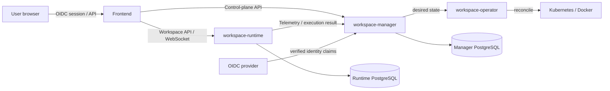

# Overall Architecture

## Purpose and Scope

Aileron is an AI development workspace platform composed of the browser frontend, the `workspace-manager` control plane, one `workspace-runtime` per workspace, background workers, and the Kubernetes Operator. This page defines cross-service responsibilities, trust boundaries, and primary flows. Service internals are covered by [Frontend Architecture](/architecture/frontend/) and [Backend Architecture](/architecture/backend/).

## Responsibilities and Non-responsibilities

Overall architecture owns product boundaries, cross-service contracts, identity and authorization, the execution plane, AI Chat, version control, Web Canvas, and platform resource observability. API fields and endpoints are authoritative in [Manager API](/api/manager-api) and [Runtime API](/api/runtime-api); this page does not duplicate endpoint inventories.

## Interface, Adapter, Seam, and Owner

| Type | Owner | Contract |
| --- | --- | --- |
| Product Interface | Frontend | routes, Product Shell, operation states, and i18n |
| Control-plane Interface | workspace-manager | resource lifecycle, Operation Policy, persistence, and scheduling |
| Execution Adapter | workspace-runtime | workspace files, Git, agents, Terminal, Browser, and Canvas |
| Reconciliation Seam | workspace-operator | Kubernetes Workspace desired/observed state |
| Machine Contract | `contracts/` | cross-layer authorization, availability, and observability formats |



## Data and Request Flow

1. The Frontend obtains the Manager-validated local user snapshot and platform `allowedOperations` from `/api/v1/oauth2/session`.
2. Workspace and knowledge-base lists additionally return `accessRole`, `accessSource(s)`, and resource `allowedOperations`.
3. Manager changes desired state; the Docker provider or Operator converges the execution environment.
4. Frontend connects to Runtime only after availability and operation gates pass; Runtime validates a Manager-issued internal credential containing the generation.
5. Runtime reports durable execution results and platform resource observations to Manager, which builds read models.

## State, Errors, and Failure Modes

The control plane and execution plane are separate: Manager availability does not imply Runtime availability. Frontend renders loading, empty, denied, unavailable, stale-generation, and recoverable-error states separately. Missing authorization fields, generation mismatch, or invalid cross-service contracts fail closed. Durable work cannot treat one successful HTTP response as completed convergence.

## Authorization, i18n, and Security

The OIDC provider owns sign-in and provider claims. Manager uses issuer + subject for local identity,
owns the `admin/member` platform role, the `reader/manager/owner` resource role, Operation
Requirements, and final authorization. The Frontend only consumes `allowedOperations`; it does not
expand roles. All user-facing text uses i18n keys. Secrets must not enter the Frontend, examples,
or logs. See [Identity and Access Control](/architecture/overview/identity-and-access).

## Source Index

- `frontend/src/app/AppRouter.tsx::AppRouter`
- `frontend/src/app/AppShell.tsx::AppShell`
- `workspace-manager/app/main.py::create_app`
- `workspace-manager/app/modules/authorization/operation_policy.py::AuthorizationOperationPolicy`
- `workspace-runtime/app/main.py::create_app`
- `workspace-operator/internal/controller/workspace_controller.go::WorkspaceReconciler`
- `contracts/authorization/wire-contract.json`
- `contracts/workspace-availability.json`

## Container Verification

```bash
docker compose -f docs-site/docker-compose.test.yml run --rm docs-test npm test
docker compose -f docs-site/docker-compose.test.yml run --rm docs-test npm run typecheck
docker compose -f docs-site/docker-compose.test.yml run --rm docs-test npm run build
```

## Related Documentation and APIs

- [Frontend Architecture](/architecture/frontend/)
- [Backend Architecture](/architecture/backend/)
- [Execution Plane](/architecture/overview/execution-plane)
- [Platform Resource Observability](/architecture/overview/platform-resource-observability)
- [Feature: Platform Overview](/features/platform/)
