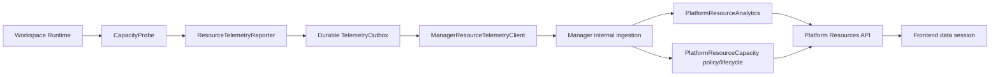

# Platform Resources and Runtime Telemetry Architecture

Platform Resources receives low-sensitivity activity and capacity observations from Runtime, builds analytics read models and capacity-governance projections in Manager, and loads management and analytics data through separate Frontend surfaces. User operations do not depend on telemetry transport success.

## Cross-plane data flow



## Runtime Telemetry

`workspace-runtime/app/modules/resource_telemetry/reporter.py` exposes `ResourceTelemetryReporter` as the Runtime interface:

- `capture_capacity()` measures Workspace project data and Runtime HOME through `CapacityProbe`.
- `record_activity()` creates `runtime_started`, Agent activity, and other explicit activity events.
- `TelemetryOutbox` persists each `TelemetryBatch` before `ResourceTelemetrySink` sends it.
- `dispatch_pending()` sends pending batches within the batch limit; failed rows remain in the outbox for retry.
- Startup, the fixed interval, delayed probes after file mutations, and shutdown draining are managed by the Reporter lifecycle.

The Reporter is fail-open: probe, outbox, or transport failures record telemetry metrics without blocking File, Git, Thread, Automation, or other Runtime operations. Capacity probes have a bounded timeout and a non-overlap lock; only one probe runs at a time.

Runtime measurement covers the Workspace project root and `/home/developer`:

- Symlinks are not followed.
- `/knowledge/<alias>` is a read-only mounted Knowledge Base and is excluded from Workspace Project Data and Runtime HOME.
- The payload contains workspace identity, Runtime instance identity, timestamps, activity events, and capacity bytes only.
- Prompts, content, filenames, paths, page views, and health-check events are not sent.

## Manager ingestion and read model

Runtime calls the Manager internal route with a scoped Bearer token:

```text
POST /api/v1/internal/workspaces/{workspace_id}/resource-telemetry/batches
```

`platform_resource_analytics/internal_router.py` validates the workspace, Runtime instance, and batch payload. Replayed batch or event identities return a deduplicated result instead of repeating activity computation. Ingestion dispatches observations to these owning modules:

| Module | Interface responsibility |
|---|---|
| `platform_resource_analytics` | Activity ledger, daily active aggregate, latest capacity observation, capacity daily snapshot, and Redis cache-aside read model |
| `platform_resource_capacity` | Risk policy, freshness, storage kind, inventory projection/filter, Knowledge Base quota, and Workspace capacity-expansion lifecycle |
| Workspace CR module | Typed capacity domain model and Kubernetes wire-contract conversion |

`PlatformResourceAnalytics` owns SQL, cache freshness, and analytics read-model maintenance. When Redis is unavailable, summary and trend queries use PostgreSQL; the analytics module does not turn cache failure into empty data.

## Capacity governance

Runtime reports observations and does not decide risk. `CapacityGovernancePolicy` supplies both in-process assessment and SQL expressions so inventory filters, projections, and UI display use the same policy:

- `normal`: below the warning threshold.
- `warning`: utilization reaches 80%.
- `critical`: utilization reaches 95%.
- `unknown`: no successful measurement exists.
- `stale`: the last successful measurement is more than 7200 seconds old.

Knowledge Base `quota_bytes = null` means the platform default quota. Workspace capacity expansion is driven by allocation, request, and target revision; Manager returns `completed` only after the current revision is observed and allocated bytes reach requested bytes. Sending Kubernetes desired state alone remains `applying`.

The complete resource kind, storage kind, range, health-group, retention, and endpoint lists are defined in [Platform Resource Statistics and Capacity Governance](/features/platform/resource-statistics-and-capacity).

## Frontend data session

Platform Resources separates management and analytics data surfaces:

- The management surface loads inventory, search, filtering, sorting, owner candidates, quota, and capacity-expansion mutations.
- The analytics surface loads summary, resource trend, and capacity trend for `7d`, `30d`, and `90d` ranges.
- Resource kind, range, management query, and analytics query each have their own URL/query identity.
- Each data block has independent loading, error, retry, and refresh state; one failed block does not clear successful data from another block.
- Mutation success invalidates only affected inventory, projection, and statistics queries rather than reloading the whole page.

`usePlatformResourcesDataSession()` is the Frontend feature orchestration interface. `PlatformResourcesPage` composes the session's data, mutations, state, and view model instead of coordinating multiple API effects directly.

## Cache, retention, and privacy

| Data | Policy |
|---|---|
| Status summary cache | Redis TTL 30 seconds; PostgreSQL fallback when Redis is unavailable |
| Activity trend cache | Redis TTL 300 seconds |
| Capacity trend cache | Redis TTL 300 seconds |
| Raw activity event | Retained for 90 days |
| Daily activity aggregate | Retained permanently |
| Capacity daily snapshot | Retained permanently |

The activity ledger stores resource type, resource id, event type, timestamp, and deduplication identity only. Telemetry does not carry user content and is not a second File or Thread history store.

## Source index

| Responsibility | Current owner |
|---|---|
| Runtime reporter | `workspace-runtime/app/modules/resource_telemetry/reporter.py` |
| Runtime probe and models | `workspace-runtime/app/modules/resource_telemetry/capacity.py`, `models.py` |
| Durable outbox | `workspace-runtime/app/modules/resource_telemetry/outbox.py` |
| Manager sink contract | `workspace-runtime/app/modules/resource_telemetry/sink.py` |
| Manager ingestion route | `workspace-manager/app/modules/platform_resource_analytics/internal_router.py` |
| Analytics read model | `workspace-manager/app/modules/platform_resource_analytics/projection.py` |
| Analytics ingestion | `workspace-manager/app/modules/platform_resource_analytics/ingestion.py` |
| Capacity policy and lifecycle | `workspace-manager/app/modules/platform_resource_capacity/` |
| Frontend data session | `frontend/src/features/platform-resources/data-session/usePlatformResourcesDataSession.ts` |
| Shared wire contract | `contracts/platform-resource-observability/wire-contract.json` |

## Verification contract

- Runtime container tests cover probe timeout, non-overlap, outbox durability, retry, shutdown drain, fail-open behavior, and the sink wire contract.
- Manager container tests cover batch authentication, Workspace/Runtime identity, deduplication, analytics aggregation, cache fallback, and capacity projection.
- Frontend container tests cover data-session query identity, independent failure, mutation invalidation, i18n, and page state.
- The docs contract test verifies that both locales contain the shared wire contract enums, thresholds, retention, and endpoints, and that the sidebar entry exists.

