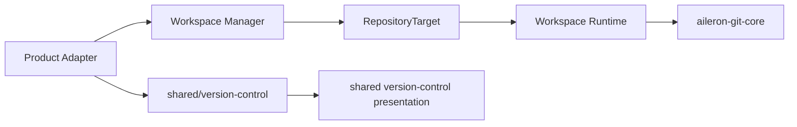

# Shared Version Control and Repository Setup

Workspace, Knowledge Base, and Marketplace use the same Git operation interfaces, data query contracts, and workbench presentation. Product differences are supplied by Adapters for the repository target, scope identity, capability, API mapping, and product content; Git core does not understand product names.

## Cross-layer ownership



| Layer | Current interface | Implementation responsibility |
|---|---|---|
| Product Adapter | Scope, resource identity, target identity, capability, and operation path | Resolve product routes, resources, Workspace worktree context, and authorization result |
| Manager target module | `RepositoryTarget` resolver | Resolve a managed resource to a safe root, lock-scope keys, environment, and branch policy |
| Runtime Version Control | `GitService`, `WorkingTreeOperationPort` | Execute Git operations on the active Runtime target and coordinate the file-write barrier and cache effects |
| `aileron-git-core` | `RepositoryTarget`, `OperationManager`, and operation contracts | Own Git transport, branches, remotes, LFS, lock scopes, and operation state |
| Frontend data package | `createVersionControlCore()` | Build query keys, API requests, invalidation, and refresh from scope, instance, and target |
| Frontend presentation package | Shared Version Control components | Own branch, changes, history, diff, remote, LFS, operation status, menu, and dialog presentation |

Frontend `@/shared/version-control` does not import React presentation; `@/shared/components/version-control` depends on the data package only. Workspace, Knowledge Base, and Marketplace retain their own routes, permissions, mutations, and target Adapters.

## Repository target interface

`aileron-git-core` uses `RepositoryTarget` as the only Git operation target contract:

```py
class RepositoryTarget:
    root: Path
    lock_scope_keys: LockScopeKeys
    environment: Mapping[str, str]
    protected_branches: tuple[str, ...]
    checked_out_branches: tuple[str, ...]
```

Target resolution finishes at the product or Manager seam:

- Knowledge Base uses `knowledge-base:{knowledge_base_id}` for both common-repository and working-tree-target identity, with a root restricted to that Knowledge Base managed storage.
- Marketplace uses `marketplace:registry` for the Registry repository identity, with a root restricted to managed Registry storage.
- Workspace resolves the active primary directory or selected Worktree into a target. Worktree context exists only in the Workspace Adapter/route seam; shared Git core does not resolve Worktrees.
- `environment` carries only the Git execution environment required by the target; protected-branch and checked-out-branch policy comes from the target.

An unvalidated filesystem path, product name, Workspace resource role, or `contextId` cannot enter shared Git core directly.

## Lock scopes

Git operations use two lock scopes:

| Scope | Protected state | Parallelizable behavior |
|---|---|---|
| `working_tree_target` | The specific working directory and Index for Stage, Unstage, Discard, Mark Resolved, and LFS snapshot conversion | Target-only operations can run on different Worktree targets concurrently |
| `common_repository` | Refs, objects, remotes, config, and Worktree metadata | Common-only operations can run on different repositories concurrently |

The operation contract classifies each operation as target-only, common-only, or both. Operations requiring both acquire `common_repository` before `working_tree_target`. `OperationManager.acquire_read_scoped()` uses the same order to fence reads from in-progress mutations.

Runtime `WorkingTreeOperationPort` provides two caller-facing surfaces:

- `mutate(operation_key, operation_name)` protects a general file mutation and invalidates file-write cache effects after success.
- `execute(...)` runs a Version Control callback, acquires the Git lock for the operation kind, and invalidates the requested cache effects after success.

`WorkingTreeOperations` is the Adapter. The File module and Version Control module share the same operation coordinator instead of creating separate locks or cache recovery paths.

## Frontend data identity

`createVersionControlCore()` builds data identity from three values:

1. `scope`: `workspace`, `knowledge-base`, or `marketplace`.
2. `instanceToken`: the resource identity; Marketplace uses a fixed shared instance and Workspace/Knowledge Base use resource identity.
3. `targetToken`: the active Repository target identity, such as a Workspace Worktree.

Every query key starts with `version-control / scope / instanceToken / targetToken / capability-group / operation`. Mutations invalidate only affected capability groups. `refresh()` invalidates the current query, refetches active queries, and returns a blocking Changes-query failure to the caller.

The product session Adapter supplies the base URL, resource id, target identity, operation path, and product-specific response mapping. Shared data core does not know route or page names.

## Repository Setup interface

Repository Setup is the shared Version Control workflow with three commands:

- `initialize(defaultBranch)`: create a Git repository at a target that is uninitialized and `canInitSafely`, using the selected default branch.
- `discoverBranches(remoteUrl)`: query remote branches and return the branch list and default branch.
- `clone(remoteUrl, branch?)`: clone a remote repository into a target that is uninitialized and `canCloneSafely`; the branch can be selected from discovery.

`useRepositorySetupWorkflow()` manages `RepositorySetupState` and `RepositorySetupViewModel`. `phase` is `idle`, `initializing`, `discovering`, or `cloning`; `canOpen*`, `canSubmit*`, and `safetyKnown` are derived from repository status, `canMutate`, and settled boundary state.

Each command contains a `generation`, increasing `id`, and `kind`. When the target, repository status, or mutation capability changes, the workflow creates a new boundary generation. An asynchronous result that does not belong to the current generation or command cannot modify state. The generation fence protects remote branch discovery, initialize, and clone.

## Workbench behavior

The three products share these data and interaction contracts:

- Branch Selector shows current, local, and remote branches, upstream, ahead/behind, and detached HEAD state.
- A remote-only branch first creates a local tracking branch and then switches to it; the start point and upstream come from explicit dialog input.
- Pull accepts only a clean, fast-forwardable working tree; Push never force-pushes. Divergence is reported without automatic merge, rebase, stash, or history rewrite.
- Unresolved conflicts block Branch switch, Pull, Commit, and Revert while allowing Fetch. Users close the conflict loop through Stage and Mark Resolved in File Changes.
- LFS tracking rules come from the current branch `.gitattributes`; LFS snapshot preview is read-only, while snapshot conversion is protected by the target lock.
- Repository Setup, first load, empty, denied, read-error, and content states render inside a ProductShell region without adding a page-level geometry-changing Banner.
- Read-only operations remain visible and disabled with a reason; a capability that truly does not exist for a product does not create its region or menu item.

## Product composition

| Product | Repository target | Product-specific responsibility |
|---|---|---|
| Workspace | Primary working directory or Workspace Worktree | Context selection, Worktree lifecycle, Runtime access, and Workspace-specific menu extension |
| Knowledge Base | Managed repository for each Knowledge Base | Knowledge Base API, resource role, sharing, attachment, and single-repository context |
| Marketplace | Managed Marketplace Registry repository | Canonical package, Registry policy, publish branch, and package content |

The three products use the same shared Git data and presentation. Products provide the target, route, permission, copy, and capability. Workspace Worktree does not appear in Knowledge Base or Marketplace APIs, types, i18n, test doubles, or conditionals.

## Source index

| Responsibility | Current owner |
|---|---|
| Repository target contract | `packages/aileron-git-core/src/aileron_git_core/contracts.py` |
| Lock and operation coordination | `packages/aileron-git-core/src/aileron_git_core/operation_lock.py` |
| Manager target resolvers | `workspace-manager/app/modules/version_control/target.py` |
| Runtime file/Git seam | `workspace-runtime/app/modules/version_control/working_tree_operations.py` |
| Runtime Git implementation | `workspace-runtime/app/modules/version_control/git_operations.py` |
| Frontend data core | `frontend/src/shared/version-control/versionControlSessionCore.ts` |
| Repository Setup state machine | `frontend/src/shared/version-control/repositorySetupWorkflowCore.ts` |
| Repository Setup effects | `frontend/src/shared/version-control/repositorySetupWorkflow.ts` |
| Shared Version Control presentation | `frontend/src/shared/components/version-control/` |
| Workspace target integration | `frontend/src/features/workspace/integrations/version-control/` |

## Verification contract

Version Control changes are tested through the corresponding interface:

- `aileron-git-core` tests target locks, operation classification, deadlock-free ordering, branches, remotes, LFS, and error contracts.
- Runtime container tests cover the File/Git operation barrier, cache invalidation, API wire contract, conflict behavior, and stale-lock behavior.
- Frontend container tests cover shared data identity, query invalidation, the Repository Setup generation fence, surface state, and shared menus/dialogs.
- Product tests cover target, permission, route, and layout mapping for Workspace, Knowledge Base, and Marketplace.
- The system has one shared Git core, one Repository Setup state machine, and deep Adapters rather than product-specific Git cores or pass-through wrappers.
